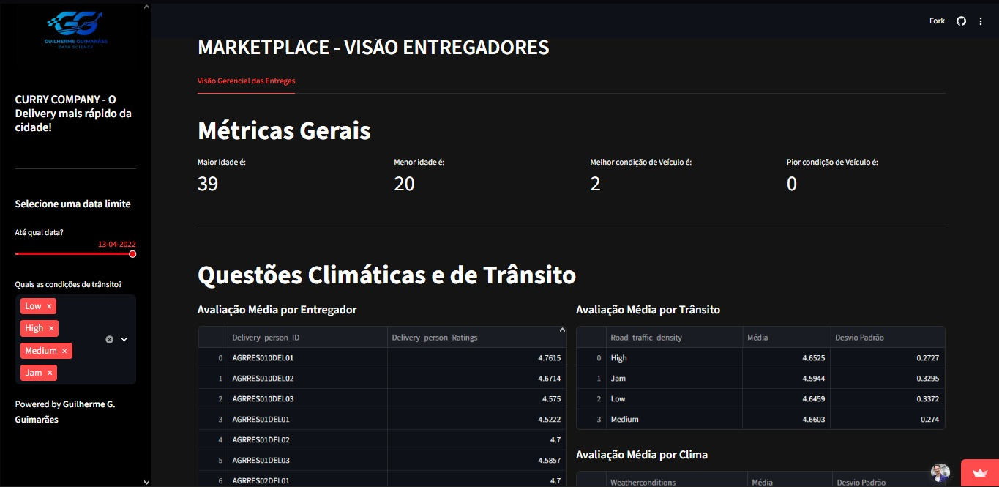

Explicação sobre o projeto Curry Company
#ReadME - Feito por Guilherme Gonçalves Guimarães

# Curry Company: Painel Estratégico de Negócios

  
  
  
  

O **Curry Company Marketplace Dashboard** é uma solução de inteligência de negócios desenvolvida para centralizar e monitorar os principais Indicadores Chave de Desempenho (KPIs) de uma empresa de tecnologia de entregas (marketplace). O objetivo principal é dar visibilidade total ao CEO e aos tomadores de decisão sobre o crescimento e a eficiência operacional da plataforma.

O painel interativo está totalmente operacional e pode ser acessado em:
 **[Acesse meu Dashboard no Streamlit Cloud](https://guilhermeguimaraesprojetocurrycompany2026.streamlit.app/Visao_Empresa)**

---

## 1. O Problema de Negócio

A Curry Company opera como um Marketplace intermediando transações entre três clientes principais: **Restaurantes**, **Entregadores** e **Compradores (Clientes)**. Embora o volume de entregas estivesse em expansão, o CEO não dispunha de visibilidade clara e centralizada sobre as métricas de crescimento e eficiência da operação.

A minha missão como Cientista de Dados neste projeto foi realizar o pipeline completo de engenharia e análise de dados (ETL), limpando uma base de dados complexa e transformando-a em uma ferramenta visual interativa única, estruturada sob três pilares de negócio:
1. **Visão da Empresa:** Métricas gerais de volume, sazonalidade e distribuição geográfica.
2. **Visão dos Entregadores:** Indicadores de performance, idade, condições de veículos e avaliações.
3. **Visão dos Restaurantes:** Eficiência de tempo de entrega, distâncias percorridas e impacto de festivais.

---

## 2. Tecnologias e Ferramentas Utilizadas

* **Python 3.x:** Linguagem base para o desenvolvimento de todo o projeto.
* **Pandas:** Biblioteca primordial para manipulação, limpeza e tratamento estruturado dos dados.
* **Plotly Express / Mapbox:** Criação de gráficos interativos e mapas de calor para análise geoespacial.
* **Streamlit & Streamlit Cloud:** Framework utilizado para a construção da interface web e hospedagem em nuvem.

---

## 3. Tratamento de Dados (Data Cleaning & ETL)

Por se tratar de dados reais de mercado, uma etapa crítica do projeto foi o **Data Cleaning**. Utilizando o rigor lógico e estatístico, foram aplicadas as seguintes transformações antes da modelagem visual:
* **Eliminação de Dados Nulos/Incompletos:** Remoção de strings contendo `'NaN '` que afetavam colunas cruciais como idade e avaliações.
* **Conversão de Tipos:** Ajuste de tipos de dados de objetos (`object`) para numéricos (`int`/`float`) e temporais (`datetime`).
* **Limpeza de Strings:** Remoção de espaços em branco sobressalentes (`strip`) em variáveis categóricas.
* **Engenharia de Recursos (Feature Engineering):** Criação da coluna de distância média utilizando a fórmula de Haversine a partir das coordenadas geográficas de latitude e longitude dos restaurantes e locais de entrega.

---

## 4. Premissas Assumidas para a Análise

1. O período de dados analisado compreende o intervalo entre **11/02/2022 e 06/04/2022**.
2. O modelo de negócio considerado foi estritamente o de **Marketplace**.
3. A análise foi categorizada sob 3 perspectivas de negócio principais: Visão Corporativa, Visão Restaurante e Visão Entregador.

---

## 5. Estratégia da Solução

O painel interativo foi desenhado para expor as métricas organizadas em abas dedicadas:

### Visão do Crescimento da Empresa
* Volume de pedidos diários e semanais.
* Distribuição percentual de pedidos por tipo de tráfego e condições de trânsito.
* Volume de pedidos cruzado por cidade e tipo de tráfego.
* Mapeamento geoespacial da localização central das cidades por tipo de tráfego.

### 🛵 Visão do Crescimento dos Entregadores
* Extremos de idade (maior e menor idade) e condições dos veículos da frota.
* Avaliações médias gerais dos entregadores, segmentadas por condições climáticas e de tráfego (com desvio padrão).
* Identificação e ranking dos 10 entregadores mais rápidos e mais lentos agrupados por cidade.

### 🏢 Visão do Crescimento dos Restaurantes
* Mapeamento do número de entregadores únicos ativos.
* Cálculo da distância média percorrida entre restaurantes e pontos de entrega.
* Tempo médio de entrega e desvio padrão global, por tipo de pedido e por cidade.
* Impacto operacional no tempo de entrega decorrente de períodos de Festivais.

---

## 6. Top 3 Insights de Dados

1. **Sazonalidade Diária Estável:** O volume de pedidos apresenta uma variação cíclica diária de aproximadamente 10% entre dias sequenciais, permitindo previsões estáveis de alocação de frota.
2. **Restrição Logística de Tráfego:** Cidades mapeadas na categoria *Semi-Urban* não registram condições de trânsito classificadas como "Baixas", indicando gargalos estruturais recorrentes nessas localidades.
3. **Volatilidade Climática:** As maiores oscilações (desvio padrão) no tempo de entrega acontecem durante condições de clima ensolarado, indicando que fatores alheios à chuva (como alta demanda em dias limpos) causam variabilidade na operação.

---

## 7. O Produto Final

O resultado prático deste projeto é um ecossistema de dados interativo web, onde o CEO pode aplicar filtros dinâmicos por data, condições de trânsito ou tipo de cidade, obtendo respostas instantâneas para tomada de decisão estratégica.

---

## 8. Conclusões

Com base no painel desenvolvido, conclui-se que o ecossistema da **Curry Company** vivenciou uma sólida tendência de crescimento contínuo, evidenciada pelo aumento expressivo no volume de pedidos semanais entre a **semana 06 e a semana 13 do ano de 2022**. A centralização desses KPIs agora mitiga a falta de visibilidade do CEO, munindo a diretoria com dados precisos em tempo real.

---

## 9. Próximos Passos

Como iterações futuras para este projeto, estão planejadas:
1. **Otimização de Métricas:** Filtragem e redução de KPIs secundários para maximizar o foco estratégico (*Lean Dashboard*).
2. **Novos Filtros Interativos:** Inclusão de segmentação avançada por avaliações específicas de restaurantes.
3. **Modelagem Preditiva:** Adicionar uma nova visão de negócio voltada à previsão de demanda e tempo de entrega utilizando algoritmos de Machine Learning.

---
Desenvolvido por **Guilherme Gonçalves Guimarães**. Conecte-se comigo no [LinkedIn](https://www.linkedin.com/in/guilherme-goncalves-guimaraes-data-scientist/) para acompanhar a minha transição para Ciência de Dados!
